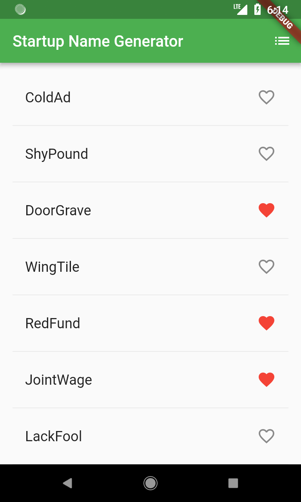
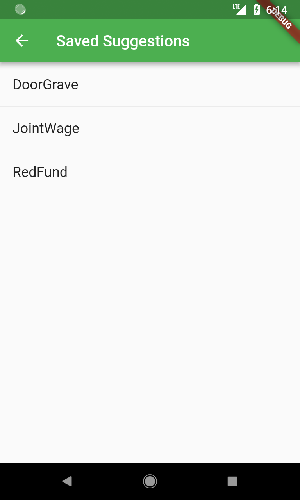

# Flutter Codelab

A Flutter project which
- shows a list of English words from an **external library**
- allows to favorite/unfavorite words using a heart icon
- shows the use of **Navigator** and **Route**
- has a second screen to show the favorite words

 

## Getting Started

This project is a starting point for a Flutter application.

A few resources to get you started if this is your first Flutter project:

- [Lab: Write your first Flutter app](https://flutter.io/docs/get-started/codelab)
- [Cookbook: Useful Flutter samples](https://flutter.io/docs/cookbook)

For help getting started with Flutter, view our 
[online documentation](https://flutter.io/docs), which offers tutorials, 
samples, guidance on mobile development, and a full API reference.
